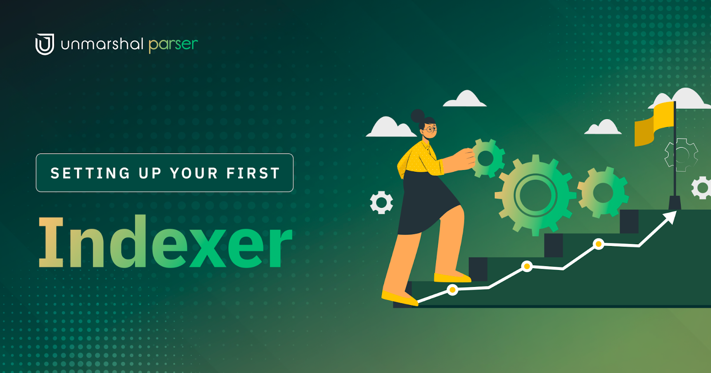

# Setting Up your own Indexer Using Unmarshal Parser




To start with, you will need to head to [Unmarshal's Unified Console](https://console.unmarshal.io/).


**1.  Login/Create an account**

To use the <Project Name>, you will need an Unmarshal account. The account is free to create and lends you access to Unmarshal's world class APIs across over 7 chains.

**2.  Click on the Parser Tab** on the sidebar to your left. Click on "Create New"


**3.**  Select **"Deploy and Maintain"** to Deploy an indexer


**4.  Select the chain** your contract is deployed on. We support a generous number of EVM based chains including testnets.


**5.  Contract Address**

Paste in your contract's address here.


**6.  Fetching ABI**

The ABI is a JSON<ref> that holds the available list of functions and events in a contract that can be accessed and their respective signatures. The form will auto-fetch a verified ABI from the official scan if available. You are also free to paste in the ABI of the contract if you wish to.


**7.  Events/Functions**

Pick the events or functions you are interested in indexing or monitoring. Indexing functions cost API credits and we currently do not index in internal transactions.


**8.  Start Block**

This item tells your parser the block number to start indexing from. If available, it points by default to the block number your contract was deployed at.

You are also free to enter a custom start block. The later your start block is, the faster the parser will be in sync with the chain at the cost of excluding transactions from older blocks.

You could also enter a block in the future to begin indexing from. (Bear in mind that the parser will lag behind the node by 10 blocks. This ensures, that all the transactions whose data is indexed are part of the canonical chain without the user having to worry about chain re-orgs)


**9.  Parser details for your reference**

Name your parser. This will help you identify and more clearly differentiate between multiple parsers.


**10.  Schema Name**
Pick a schema name for your parser. If you wish, you could reuse a schema name across multiple parsers as long as each is indexing a different contract.

You could also have multiple parsers indexing the same contract as long as they use different schemas.


**Submit your request!**

Et voilà, your parser is up and running!! No worrying about instances or compute units, manifests or any of that technical gobbledygook.


Now that you have a parser running and in-sync, you might be wondering how you gain access to that data? Unmarshal provides you with two easy ways to either visualise or query all that data.

# Accessing your data

The Parser provides two ways of accessing the data that you have indexed.

## Metabase

**What exactly is it?**

Metabase is analogous to a GUI for a Database that gives you full access to your data. Apart from the ability to see data in a tabulate format, it allows you to run SQL queries to access your data. It also provides you with the ability to create dashboards like the one [here](https://stake.unmarshal.io/analytics/493a7f3a-c151-47db-92ca-4fbe8dd7e4e5), created for Unmarshal's very own [staking platform](https://stake.unmarshal.io/).


You can read more about Metabase [here](https://www.metabase.com/learn/getting-started/getting-started.html).

**Who is it for?**

Metabase is a powerful tool for visualising on-chain protocol data which can be used by researchers, dApps, and investors for data analytics.

Check out our [webinar](https://www.youtube.com/watch?v=owtdrGFtj5c&t=3s) to understand how dApp analytics can be used to improve application performance and analyse user behaviour.

**How do I access it?**

The login credentials for metabase are available on your parser tab. You can click on the "View Details" button to get the URL, Username and Password. Keep in mind that you are free to change your password after logging in, to whatever you prefer.

For more details refer to <Metabase page link>


## GraphQL

**What exactly is it?**

The service starts a GraphQL server for you with all the schemas and resolvers auto-generated. GraphQL is an easy way to access all data in your database and cherry pick what you want in your response. GraphQL is a "Query Language" that you can submit via post requests to a server that supports it. You can learn more about it [here](https://graphql.org/learn/queries/).

**Who is it for?**

With the help of GraphQL APIs, dApp builders can access on-chain data in the form of APIs that can be integrated into their applications through backend. It is a great querying tool to access highly specific, rich protocol data outside of the one provided by our standard set of Unmarshal APIs.

How do I access it?

Refer to <GraphQL page link>
Setting Up your own Indexer Using Unmarshal Parser


To start with, you will need to head to Unmarshal's Unified Console.

1. Login/Create an account

To use the , you will need an Unmarshal account. The account is free to create and lends you access to Unmarshal's world class APIs across over 7 chains.

2. Click on the Parser Tab on the sidebar to your left. Click on "Create New"


3. Select "Deploy and Maintain" to Deploy an indexer


4. Select the chain your contract is deployed on. We support a generous number of EVM based chains including testnets.


5. Contract Address

Paste in your contract's address here.


6. Fetching ABI

The ABI is a JSON that holds the available list of functions and events in a contract that can be accessed and their respective signatures. The form will auto-fetch a verified ABI from the official scan if available. You are also free to paste in the ABI of the contract if you wish to.


7. Events/Functions

Pick the events or functions you are interested in indexing or monitoring. Indexing functions cost API credits and we currently do not index in internal transactions.


8. Start Block

This item tells your parser the block number to start indexing from. If available, it points by default to the block number your contract was deployed at.

You are also free to enter a custom start block. The later your start block is, the faster the parser will be in sync with the chain at the cost of excluding transactions from older blocks.

You could also enter a block in the future to begin indexing from. (Bear in mind that the parser will lag behind the node by 10 blocks. This ensures, that all the transactions whose data is indexed are part of the canonical chain without the user having to worry about chain re-orgs)


9. Parser details for your reference

Name your parser. This will help you identify and more clearly differentiate between multiple parsers.


10. Schema Name
    Pick a schema name for your parser. If you wish, you could reuse a schema name across multiple parsers as long as each is indexing a different contract.

You could also have multiple parsers indexing the same contract as long as they use different schemas.


Submit your request!

Et voilà, your parser is up and running!! No worrying about instances or compute units, manifests or any of that technical gobbledygook.


Now that you have a parser running and in-sync, you might be wondering how you gain access to that data? Unmarshal provides you with two easy ways to either visualise or query all that data.

Accessing your data
The Parser provides two ways of accessing the data that you have indexed.

Metabase
What exactly is it?

Metabase is analogous to a GUI for a Database that gives you full access to your data. Apart from the ability to see data in a tabulate format, it allows you to run SQL queries to access your data. It also provides you with the ability to create dashboards like the one here, created for Unmarshal's very own staking platform.

You can read more about Metabase here.

Who is it for?

Metabase is a powerful tool for visualising on-chain protocol data which can be used by researchers, dApps, and investors for data analytics.

Check out our webinar to understand how dApp analytics can be used to improve application performance and analyse user behaviour.

How do I access it?

The login credentials for metabase are available on your parser tab. You can click on the "View Details" button to get the URL, Username and Password. Keep in mind that you are free to change your password after logging in, to whatever you prefer.

For more details refer to

GraphQL
What exactly is it?

The service starts a GraphQL server for you with all the schemas and resolvers auto-generated. GraphQL is an easy way to access all data in your database and cherry pick what you want in your response. GraphQL is a "Query Language" that you can submit via post requests to a server that supports it. You can learn more about it here.

Who is it for?

With the help of GraphQL APIs, dApp builders can access on-chain data in the form of APIs that can be integrated into their applications through backend. It is a great querying tool to access highly specific, rich protocol data outside of the one provided by our standard set of Unmarshal APIs.

How do I access it?

Refer to

Markdown 7094 bytes 778 words 114 lines Ln 110, Col 86HTML 3521 characters 755 words 44 paragraphs
4:28
# How do I access my Smart Contract data Through Metabase?


Now that you are done with creating your parser, which is actively tracking your data, parsing it, and saving it to a Postgres database, let's move to the question of how to access the data?

For data access, we provide add-ons to our users. One of these add-ons is Metabase.

Metabase is an open-source tool to help you extract information from your data. You can use Metabase to build out beautiful internal and public dashboards, save and share queries, etc.

Before getting started with Metabase, let's revisit the structure of your indexed data.

## Understanding the structure of your data

In the Parser series (Part 2): Creating your first parser?, we deployed a parser for the Marsh ERC20 contract, we will continue to use it as an example.

-   When you create your parser you are asked to enter the database name in which your data is to be indexed. The database name corresponds to a schema in Postgres.


*Fig. 1.1 Parser form highlighting the database name field*

-   Don't remember the name you gave? The name of the schema where your parser is writing data can be found under the View details section.


*Fig 1.2 Parser listing screen view details section*


*Fig 1.3 Schema name in the parser View details window*

-   As initially mentioned, all of your data tables are saved under this schema.

-   The data of each of the contract events/functions selected for indexing(at the time of parser creation) is saved into corresponding tables.


**Table nomenclature**

-   All of the table names are in snake case and are postfixed with _events and _methods for event and function tables respectively.


In the above example, we selected the following events and functions for indexing

1.  Events: Approval, Transfer

2.  Functions: transferFrom


We could expect to see find the following tables in our schema

1.  Event tables: approval_events, transfer_events

2.  Function tables: transfer_from_methods


## Logging in to Metabase

**TL;DR**

You can find your Metabase credentials under the parser section on the Unmarshal console page. It is important to note that you will only be able to view your Metabase credentials once you have deployed at least one parser.

**Detailed steps**

-   Click on the View details in the Metabase Add-On


*Fig. 1.4 Metabase add-on view details section*

-   Click on the URL available in the Metabase popup window


*Fig. 1.5 URL in Metabase View details window*

-   Use the above credentials to log into Metabase

-   And just like that, you are one step closer to curating information from the data collected by your parser


## Getting used to Metabase

> "Great, I can see the Metabase homepage but what does it all mean?" Might be the immediate next question you have if you are not already familiar with Metabase.

In this section, we would be going over the terminology commonly used when working with Metabase. If you are already familiar with Metabase feel free to skip this section.

Metabase is a widely used tool, and has a lot of learning resources online, to help in your analytics.

## **Terminology**


*Fig. 1.6 Metabase homepage highlighting sections*

**Data (1)**


*Fig. 1.7 Browse data screen within Metabase*

1.  This section serves as a GUI client for the data collected for your indexers.

2.  On clicking browse data, you get a data source with your Unmarshal console username. (Fig. 1.7)

3.  Digging a little deeper into the data source with your username, you see one of two.

4.  The tables in the data source if, you only have a single schema in which a parser is deployed. Metabase defaults the view to the only available schema.

5.  A list of available schemas across which your parsers have indexed the data. (Fig 1.8)

6.  In our case, we have deployed multiple parsers from our account in different schemas and hence we see a list of schemas.

7.  Within each of the schemas, you have your data tables as described before. (Fig 1.9)

8.  Here is the table structure within our marsh_erc20_parser schema.

9.  This section in Metabase helps you give a nice overview of the data you are working with.


*Fig 1.8 Schemas available in your data source*


*Fig 1.9 Table structure within the marsh_erc20_parser schema*

**Questions and SQL (2)**

1.  More often than not, you would want to curate specific information from the data tables.

2.  To do this you could either choose to write a custom SQL query or you could use the query builder abstraction which Metabase provides also known as Question.

3.  SQL is a powerful yet relatively simple data access abstraction to work with. If you are unfamiliar with it there is tons of documentation and guides available to help you out. (As we save your data in a Postgres database, be sure to refer to related documentation)

4.  Given that you have become familiar with SQL, writing your first query might still need some help given the hierarchy of schemas and data tables, we will get to this in a moment.

5.  Metabase also lets you visualise the results of Questions/SQL queries in different forms like pie charts, tables, line graphs, bar graphs, etc.


**Card (3)**

1.  A card symbolises a saved question or SQL query along with its visualisation settings.


**Dashboard (4)**

1.  A dashboard is a single page within which multiple cards can be embedded into.

2.  The cards can be resized and moved around to increase the readability of your curated cards.

3.  Apart from having login limited access to the dashboard, the dashboard could also be made public.


**Collection (5)**

1.  This is a grouping feature in Metabase that lets the users aggregate data based on logical affinity.

2.  By default, you have access to Our analytics, a collection where all of the public dashboards reside and Your personal collection where all sub-collections which only you have access to reside.

3.  As hinted at in the previous point, you can have nested collections in Metabase, which lets you better group your information.


## Querying your data through SQL

Metabase makes it easy for you to curate data using the Question query builder. But un-avoidably there would be cases where you have to write your SQL queries.

This is not intended on being a guide on writing PostgreSQL queries, there is an abundance of that available online. Here, using an example we want to highlight the schema and table relationship to help you along the way.

Let's suppose you are looking for an answer to the following question,

Question: Get me the total number of transfers made on the marsh smart contract along with the volume in $MARSH between 2022–02–07 and 2022–02–08


*Fig. 1.10 SQL query editor on Metabase*

**Query**

```
SELECT
	count(id), transfer_count,
	sum(value::numeric)/1e18 transfer_volume
FROM marsh_erc20_parser.transfer_events
WHERE block_time
BETWEEN timestamp '2022–02–07'
AND timestamp '2022–02–08';
```
Here is what the query would look like.  **It is important to note the hierarchy of the data.**  Since the data for the transfer event is saved within the schema in which the parser is deployed, to access the data a similar hierarchy will have to be used.

## **Challenge**

Here is a challenge for you. For your parser complete the following and tag us on Twitter with  **#UnmarshalParser**, we would pick the best dashboards and make them public to showcase them on  [Unmarshal Analytics Showcase](https://analytics.unmarshal.io/)

1.  Create a collection in your personal collection
2.  Create your first query
3.  Save your query as a Card
4.  Create a dashboard
5.  Play around and make it as informative as possible

## Advanced level

> By now you should be fairly familiar with Metabase and the structure of your data!

In this section, we would go over a couple of powerful tools that you would feel the need for when building complex dashboards.

**Cross schema querying**

Sooner than later, you will have requirements where you have to aggregate data from multiple smart contracts e.g. if you have multiple smart contracts powering your DAPP.

As mentioned previously, we index your data in Postgres schemas, and Postgres supports cross-querying across all of your schemas making this a non-issue.

**Making dashboards public**

Reach out to Unmarshal either on [Telegram](https://t.me/Unmarshal_Chat), [Twitter](https://twitter.com/unmarshal) or Discord and we can help you out with this. Once your dashboard has been made public by the Unmarshal team, you will get a link which can either be directly used or embedded in your web application using an IFrame.
