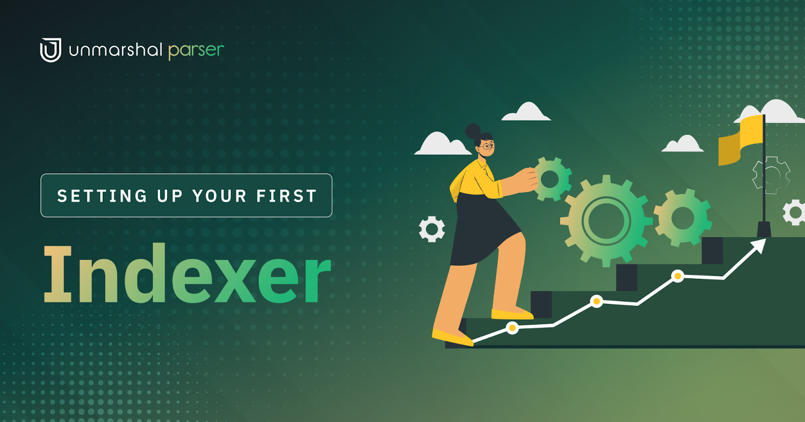
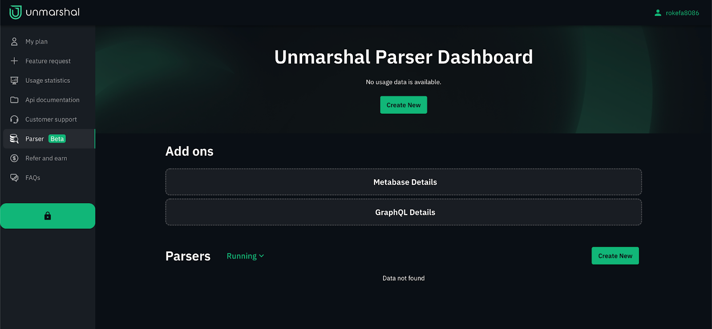
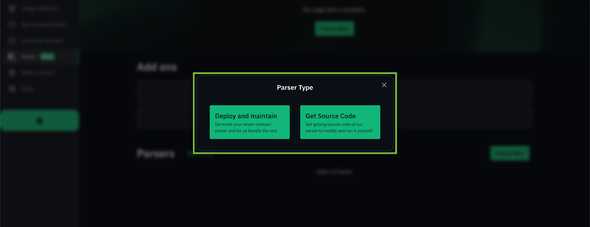
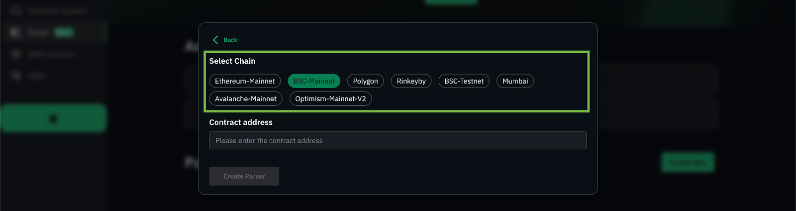
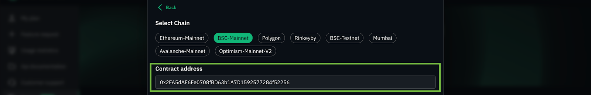
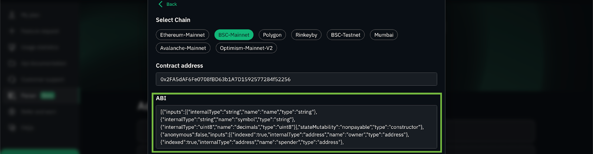
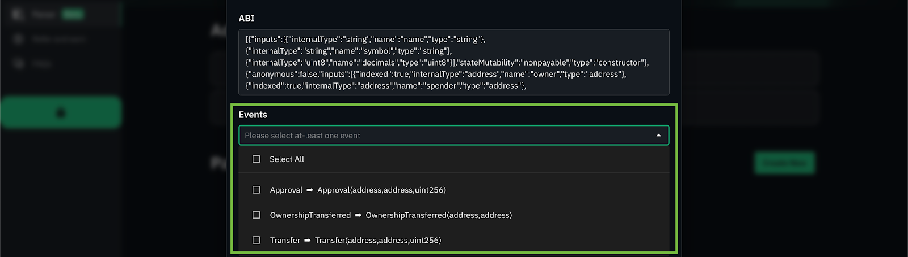
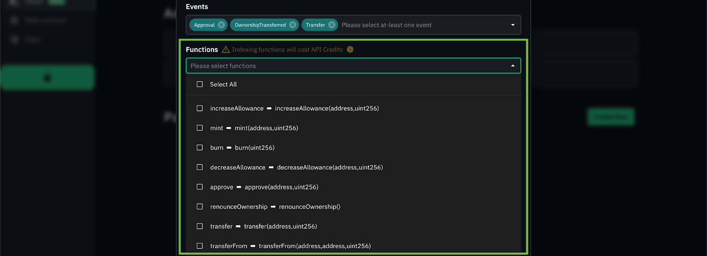
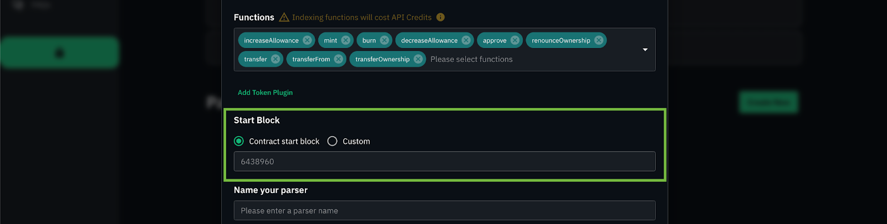

## Setting up an Indexer Using Unmarshal Parser

To start with, you will need to head to [Unmarshal’s Unified Console](https://console.unmarshal.io/).

**1. Login/Create an account**

To use the <Project Name>, you will need an Unmarshal account. The account is free to create and lends you access to Unmarshal’s world class APIs across over 7 chains.

**2. Click on the Parser Tab** on the sidebar to your left. Click on “Create New”

**3.** Select **“Deploy and Maintain”** to Deploy an indexer

**4. Select the chain** your contract is deployed on. We support a generous number of EVM based chains including testnets.

**5. Contract Address**

Paste in your contract’s address here.

**6. Fetching ABI**

The ABI is a JSON<ref> that holds the available list of functions and events in a contract that can be accessed and their respective signatures. The form will auto-fetch a verified ABI from the official scan if available. You are also free to paste in the ABI of the contract if you wish to.

**7. Events/Functions**

Pick the events or functions you are interested in indexing or monitoring. Indexing functions cost API credits and we currently do not index in internal transactions.

**8. Start Block**

This item tells your parser the block number to start indexing from. If available, it points by default to the block number your contract was deployed at.

You are also free to enter a custom start block. The later your start block is, the faster the parser will be in sync with the chain at the cost of excluding transactions from older blocks.

You could also enter a block in the future to begin indexing from. (Bear in mind that the parser will lag behind the node by 10 blocks. This ensures, that all the transactions whose data is indexed are part of the canonical chain without the user having to worry about chain re-orgs)

**9. Parser details for your reference**

Name your parser. This will help you identify and more clearly differentiate between multiple parsers.

**10. Schema Name**
Pick a schema name for your parser. If you wish, you could reuse a schema name across multiple parsers as long as each is indexing a different contract.

You could also have multiple parsers indexing the same contract as long as they use different schemas.

**Submit your request!**

Et voilà, your parser is up and running!! No worrying about instances or compute units, manifests or any of that technical gobbledygook.

Now that you have a parser running and in-sync, you might be wondering how you gain access to that data? Unmarshal provides you with two easy ways to either visualise or query all that data.

# Accessing your data

The Parser provides two ways of accessing the data that you have indexed.

## Metabase

**What exactly is it?**

Metabase is analogous to a GUI for a Database that gives you full access to your data. Apart from the ability to see data in a tabulate format, it allows you to run SQL queries to access your data. It also provides you with the ability to create dashboards like the one [here](https://stake.unmarshal.io/analytics/493a7f3a-c151-47db-92ca-4fbe8dd7e4e5), created for Unmarshal’s very own [staking platform](https://stake.unmarshal.io/).

You can read more about Metabase [here](https://www.metabase.com/learn/getting-started/getting-started.html).

**Who is it for?**

Metabase is a powerful tool for visualising on-chain protocol data which can be used by researchers, dApps, and investors for data analytics.

Check out our [webinar](https://www.youtube.com/watch?v=owtdrGFtj5c&t=3s) to understand how dApp analytics can be used to improve application performance and analyse user behaviour.

**How do I access it?**

The login credentials for metabase are available on your parser tab. You can click on the “View Details” button to get the URL, Username and Password. Keep in mind that you are free to change your password after logging in, to whatever you prefer.

For more details refer to <Metabase page link>

## GraphQL

**What exactly is it?**

The service starts a GraphQL server for you with all the schemas and resolvers auto-generated. GraphQL is an easy way to access all data in your database and cherry pick what you want in your response. GraphQL is a “Query Language” that you can submit via post requests to a server that supports it. You can learn more about it [here](https://graphql.org/learn/queries/).

**Who is it for?**

With the help of GraphQL APIs, dApp builders can access on-chain data in the form of APIs that can be integrated into their applications through backend. It is a great querying tool to access highly specific, rich protocol data outside of the one provided by our standard set of Unmarshal APIs.

How do I access it?

Refer to <GraphQL page link>
