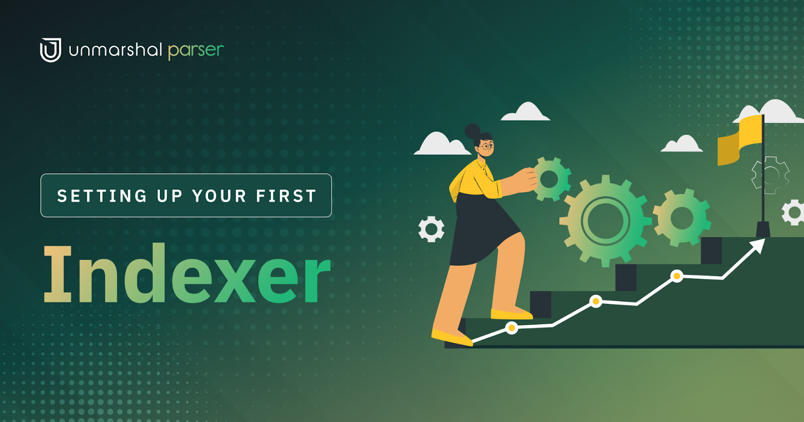

# Setting up an Indexer Using Unmarshal Parser

To start with, you will need to head to [Unmarshal’s Unified Console](https://console.unmarshal.io/).

<iframe src="https://app.tango.us/app/embed/db35d34f-5b69-4327-99f8-1e3ea3debb83?iframe" sandbox="allow-scripts allow-top-navigation-by-user-activation allow-popups allow-same-origin" security="restricted" title="Tango Workflow" width="100%" height="750px" referrerpolicy="strict-origin-when-cross-origin" frameborder="0" webkitallowfullscreen="webkitallowfullscreen" mozallowfullscreen="mozallowfullscreen" allowfullscreen="allowfullscreen"></iframe>

Now that you have a parser running and in-sync, you might be wondering how you gain access to that data? Unmarshal provides you with 5 easy ways to either visualise or query all that data.

# Accessing your data

Parser provides two ways of accessing the data that you have indexed.

## Metabase

### What exactly is it?

Metabase is analogous to a GUI for a Database that gives you full access to your data. Apart from the ability to see data in a tabulate format, it allows you to run SQL queries to access your data. It also provides you with the ability to create dashboards like the one's [here](https://stake.unmarshal.io/analytics/493a7f3a-c151-47db-92ca-4fbe8dd7e4e5), created for Unmarshal’s very own [staking platform](https://stake.unmarshal.io/). ([Other dashboards](https://analytics.unmarshal.io/))

You can read more about Metabase [here](https://www.metabase.com/learn/getting-started/getting-started.html).

### Who is it for?

Metabase is a powerful tool for visualising on-chain protocol data which can be used by researchers, dApps, and investors for data analytics.

Check out our [webinar](https://www.youtube.com/watch?v=owtdrGFtj5c&t=3s) to understand how dApp analytics can be used to improve application performance and analyse user behaviour.

### How do I access it?

Refer to [Accessing parser data through Metabase](/docs/parser/metabase/)

## GraphQL

### What exactly is it?

The service starts a GraphQL server for you with all the schemas and resolvers auto-generated. GraphQL is an easy way to access all data in your database and cherry pick what you want in your response. GraphQL is a “Query Language” that you can submit via post requests to a server that supports it. You can learn more about it [here](https://graphql.org/learn/queries/).

### Who is it for?

With the help of GraphQL APIs, dApp builders can access on-chain data in the form of APIs that can be integrated into their applications through backend. It is a great querying tool to access highly specific, rich protocol data outside of the one provided by our standard set of Unmarshal APIs.

### How do I access it?

Refer to [Accessing parser data through GraphQL](/docs/parser/graphql/)

## Unmarshal Inhouse Data Explorer

View schema, tables and write simple SQL queries to extract data from tables.

## Prebuilt Analytics

A set of contract analytics charts and event/function analytics charts are generated by default.
