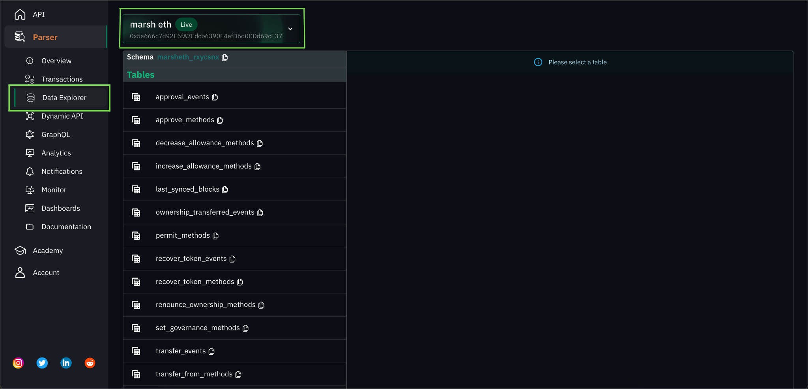

# Accessing parser data through Data Explorer and Dynamic API


You now have an understanding on creating APIs using GraphQL. Still not familiar with the concept? Don't worry, We've got you covered!

The in-house data explorer is a user-friendly interface that allows developers to easily search and visualize blockchain data.

Furthermore, Unmarshal's dynamic API provides a flexible and customizable solution for developers looking to build blockchain applications. It allows developers to retrieve specific data points and filter results based on a range of criteria. This makes it easy to integrate blockchain data into third-party applications and services.

Let's quickly go through the steps to access parser data through Data Explorer and Dynamic API.

## Data Explorer

Unmarshal's in-house Data explorer gives you an overview of your schema and the tables that hold the protocol data indexed from your smart contract.

Navigate to the Data Explorer section under the Parser tab and select the parser whose schema you want to view as shown in Fig 1.1



_Fig 1.1 Data Explorer_

Click on the table to view table structure as shown in Fig 1.2


_Fig 1.2 Selecting table to view structure_

The below image highlights the structure of the selected table


_Fig 1.3 View structure of the selected table_

## Dynamic API [](https://preview.redoc.ly/unmarshal/docs-revamp/docs/parser/data_explorer/#dynamic-api)

Are you not familiar with GraphQL or do you find using GraphQL complicated? We've got the right solution for you! You can now write an SQL query and create an API out of it with a single click using Unmarshal's Dynamic API feature.

Navigate to the Dynamic API section under the Parser tab and select the parser for which you want to create an API as shown in Fig 1.4.


_Fig 1.4 Dynamic API_

Replace `YOUR_SCHEMA_NAME` with your schema name and `YOUR_TABLE_NAME` with the table which the data is to be extracted and alter the query based on the data you want to extract.

Then click on the `Execute` button


_Fig 1.5 Writing and executing SQL query_

We now have our query response as shown below.


_Fig 1.6 Query response_

To use this response in your dApp, click on the `Generate API` button which will generate an API and copy the cURL of the request to your clipboard as follows. Integrate this API in your dApp.


```shell
curl --location --request
POST 'https://api.unmarshal.com/v1/parser/42c69e76-489f-48b3-bcc3-5cdcfb0adccc/execute?auth_key=YOUR_API_KEY'
--header 'Content-Type: application/json'
--data-raw '{
  "query": "SELECT * FROM marsheth_rxycsnx.approval_events LIMIT 10"
}'
```

_Fig 1.7 Generate API_

For more queries, reach out to Unmarshal either on [Telegram](https://t.me/Unmarshal_Chat), [Twitter](https://twitter.com/unmarshal) or [Discord](https://discord.gg/SqhYdGYtEr) and we can help you out with this.
