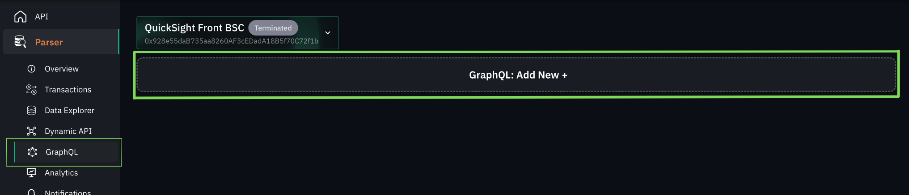
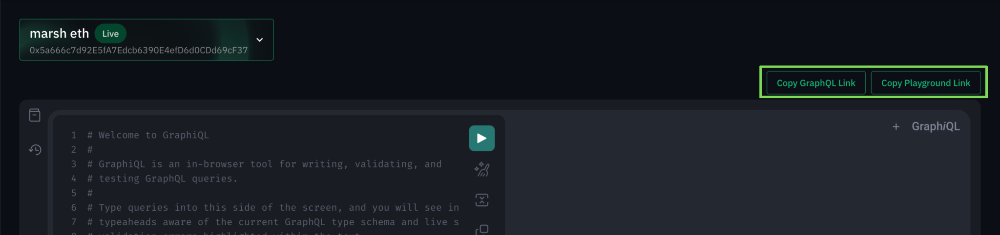
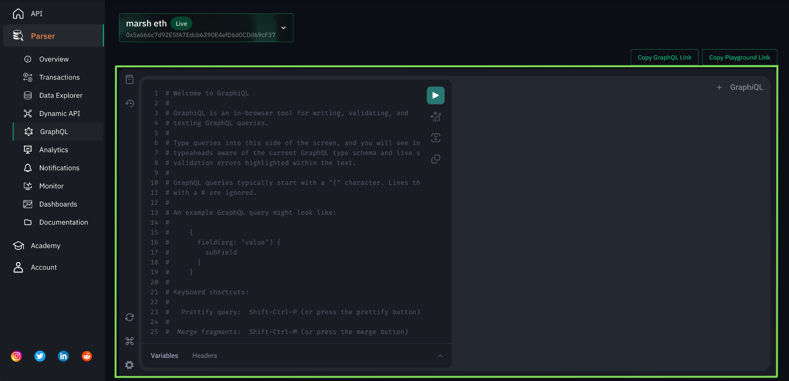

# Accessing parser data through GraphQL

By now you would have a fair understanding of the data aggregated by your parser and know how to access it and create dashboards through Metabase.

The other **add-on** we provide to our users, to access their parser data is **GraphQL API**.

When building **Unmarshal Parser**, we realised, that there would be cases where you would want to access the parser data outside of Metabase like, if you wish for real-time analytical data of your smart contract to be displayed on your web application.

> Ok, but where do I define the schema for my GraphQL API? Or have you taken care of that too?

Continuing our open source first approach, under the hood [Postgraphile](https://www.graphile.org/) powers our GraphQL engine. **Postgraphile** for those of you who are not familiar is a tool which generates a powerful and performant GraphQL API for a given Postgres schema.

Being a team of developers ourselves, we understand the lifecycle of a software product and how frequently there could be unanticipated changes, especially on the user-facing aspect of the product.

Tools like **TheGraph** require the subgraph developer to make all of the GraphQL schema-related decisions upfront compromising on flexibility. If a developer wants to update the schema, they would have to come out with a newer version of the subgraph which again would take its own time to develop and get in sync.

Contrary to the other such tools available to access your smart contract data, **Unmarshal Parser** focuses on ease of use for developers, and reduction in development time, all while remaining as flexible as possible.

> Sounds great, how do I get started?

Enabling GraphQL for your data is simple, just

1. Head over to the parser section on your console and click on GraphQL in the side navigation bar.
2. Click on the GraphQL: Add New button.

_Fig 1.1 GraphQL page highlighting the ***Add New*** button_

_It is important to note that the GraphQL API is associated with Postgres schemas. Hence, each of the Postgres schemas where your data has been written has its own entry point._

Once ready, your GraphQL page should look like this,

_Fig 1.2 Copy GraphQL API endpoint and GraphiQL playground links once GraphQL is ready_

As seen in _Fig 1.2,_ for each database schema you get access to two endpoints

1.  The GraphQL API endpoint itself. Which you could use to get data in your production environment
2.  An endpoint to access your GraphQL Playground. The playground section is intended to also serve as the documentation for the available GraphQL API.

_Fig 1.3 GraphQL playground embedded_

Select the parser to get parser specific GraphQL API and playground links for the parser you want to access through GraphQL as shown in Fig 1.4

_Fig 1.4 Parser Selection_

_Fig 1.5 GraphiQL playground for marsh eth parser_

> But, what if I want an API which fetches data in a custom format and with custom filters?

We have you covered,

1.  Head over to our [Unmarshal Parser GraphQL](https://github.com/eucrypt) GitHub.
2.  Raise a new pull request from a GitHub account linked to the email same as the Unmarshal Console user and mention, the parser id along with the query to fetch your data.
3.  Once verified for correctness and efficiency, we would merge the pull request and you would have access to the new API.
