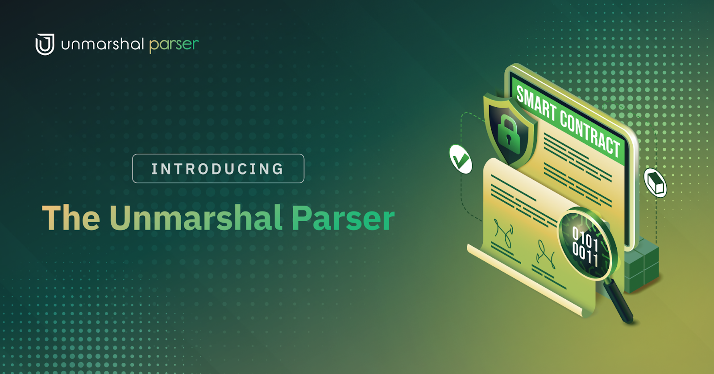

# What is Unmarshal Parser?

If, you’re a DApp Developer who’s looking for ways to gain access to all of your smart contract’s data but you don’t know how? Or you’re researching a project and want to gauge interest in it by monitoring events and function calls in their smart contract?

There could be any number of reasons you have for wanting specific data from the blockchain. There’s been no usable, non technically invasive way to do this until now.

Presenting, **The Unmarshal Parser**

Parser allows users to index events and functions relating to any smart contract to a relational database. Once decoded and indexed, the data is made accessible through

1. Metabase Dashboards
2. GraphQL APIs
3. Unmarshal Inhouse Data Explorer
4. Unmarshal Sakhi
5. Prebuilt Analytics

The parser tool differentiates itself by its off-chain data enhancements. This is made possible through the **parser plugins**. Currently parser supports plugins to fetch token details, historical token price, and live token price.
