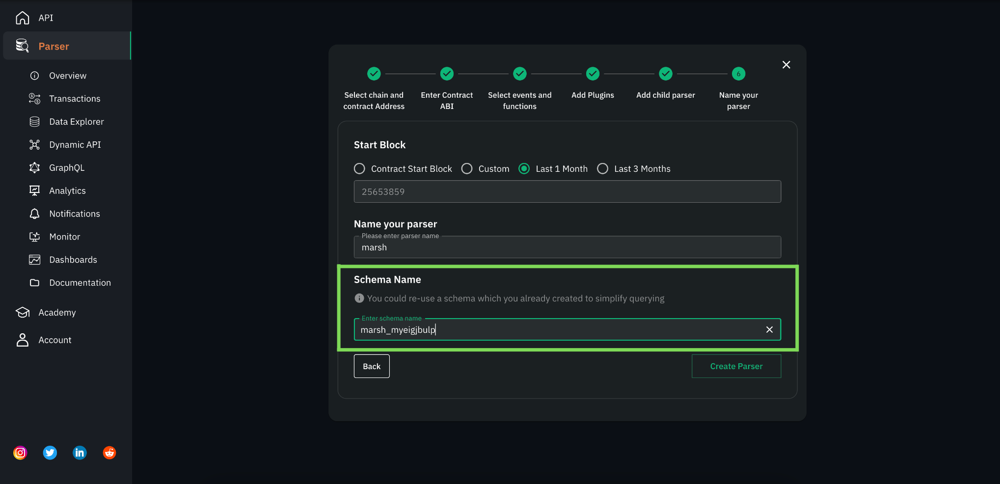
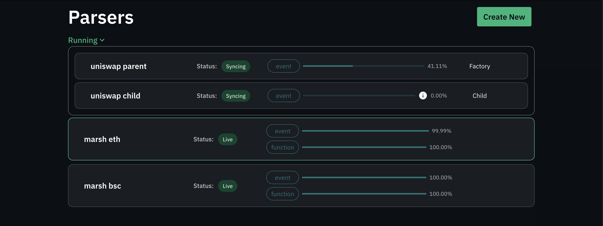
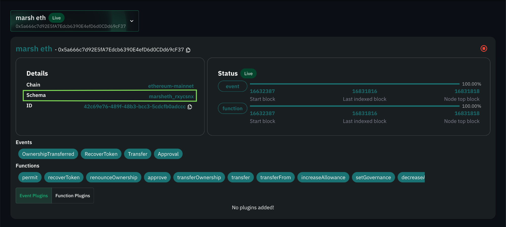
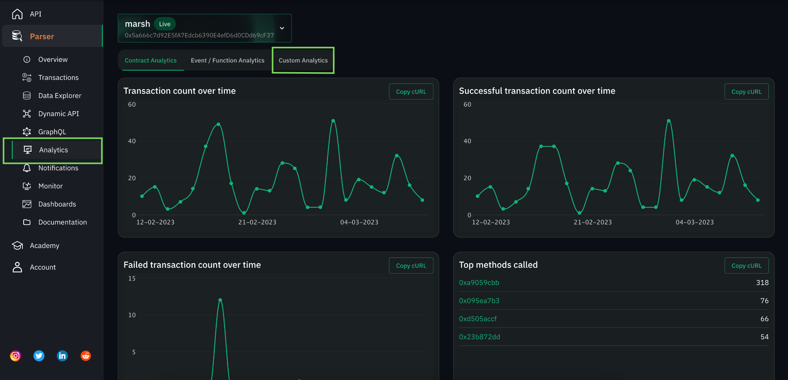

# Accessing parser data through Metabase


Now that you are done with creating your parser, which is actively tracking your data, parsing it, and saving it to a Postgres database, let’s move to the question of how to access the data?

For data access, we provide add-ons to our users. One of these add-ons is Metabase.

Metabase is an open-source tool to help you extract information from your data. You can use Metabase to build out beautiful internal and public dashboards, save and share queries, etc.

Before getting started with Metabase, let’s revisit the structure of your indexed data.

## Understanding the structure of your data

In the previous section [Setting up an Indexer Using Unmarshal Parser
](/docs/parser/create_parser/), we deployed a parser for the Marsh ERC20 contract, we will continue to use it as an example.

- When you create your parser you are asked to enter the **schema name** in which your data is to be indexed. The **schema name** corresponds to a schema in Postgres.



_Fig. 1.1 Parser form highlighting the schema name field_

- **Don’t remember the name you gave?** The name of the schema where your parser is writing data can be found upon clicking on a respective parser.



_Fig 1.2 Parsers list_



_Fig 1.3 Schema name in the parser details window_

- As initially mentioned, all of your data tables are saved under this schema.
- The data of each of the contract events/functions selected for indexing(at the time of parser creation) is saved into corresponding tables.

**Table nomenclature**

- All the table names are in snake case and are postfixed with `_events` and `_methods` for event and function tables respectively.

For example, if we selected the following events and functions for indexing

1.  Events: `Approval`, `Transfer`
2.  Functions: `transferFrom`

We could expect to find the following tables in our schema

1.  Event tables: `approval_events`, `transfer_events`
2.  Function tables: `transfer_from_methods`

## Logging in to Metabase

**TL;DR**

You can find your Metabase credentials under the parser section on the Unmarshal console page. It is important to note that you will only be able to view your Metabase credentials once you have deployed at least one parser.

**Detailed steps**

- Click on the Analytics section present at the side nav bar and head on to Custom Analytics Tab



_Fig. 1.4 Metabase add-on credentials section_

- Click on the URL available in the Metabase window


_Fig. 1.5 URL in Metabase credentials window_

- Use the above credentials to log into Metabase
- And just like that, you are one step closer to curating information from the data collected by your parser

## Getting used to Metabase

> “Great, I can see the Metabase homepage but what does it all mean?” Might be the immediate next question you have if you are not already familiar with Metabase.

In this section, we would be going over the terminology commonly used when working with Metabase. If you are already familiar with Metabase feel free to skip this section.

Metabase is a widely used tool, and has a lot of learning resources online, to help in your analytics.

## **Terminology**


_Fig. 1.6 Metabase homepage highlighting sections_

### Data (1)


_Fig. 1.7 Browse data screen within Metabase_

1.  This section serves as a GUI client for the data collected for your indexers.
2.  On clicking browse data, you get a data source with your Unmarshal console username. (Fig. 1.7)
3.  Digging a little deeper into the data source with your username, you see one of two.
4.  The tables in the data source if, you only have a single schema in which a parser is deployed. Metabase defaults the view to the only available schema.
5.  A list of available schemas across which your parsers have indexed the data. (Fig 1.8)
6.  In our case, we have deployed multiple parsers from our account in different schemas and hence we see a list of schemas.
7.  Within each of the schemas, you have your data tables as described before. (Fig 1.9)
8.  Here is the table structure within our marsh_erc20_parser schema.
9.  This section in Metabase helps you give a nice overview of the data you are working with.


_Fig 1.8 Schemas available in your data source_


_Fig 1.9 Table structure within the marsh_erc20_parser schema_

### Questions and SQL (2)

1.  More often than not, you would want to curate specific information from the data tables.
2.  To do this you could either choose to write a custom SQL query or you could use the query builder abstraction which Metabase provides also known as Question.
3.  SQL is a powerful yet relatively simple data access abstraction to work with. If you are unfamiliar with it there is tons of documentation and guides available to help you out. (As we save your data in a Postgres database, be sure to refer to related documentation)
4.  Given that you have become familiar with SQL, writing your first query might still need some help given the hierarchy of schemas and data tables, we will get to this in a moment.
5.  Metabase also lets you visualise the results of Questions/SQL queries in different forms like pie charts, tables, line graphs, bar graphs, etc.

### Card (3)

1.  A card symbolises a saved question or SQL query along with its visualisation settings.

### Dashboard (4)

1.  A dashboard is a single page within which multiple cards can be embedded into.
2.  The cards can be resized and moved around to increase the readability of your curated cards.
3.  Apart from having login limited access to the dashboard, the dashboard could also be made public.

### Collection (5)

1.  This is a grouping feature in Metabase that lets the users aggregate data based on logical affinity.
2.  By default, you have access to Our analytics, a collection where all of the public dashboards reside and Your personal collection where all sub-collections which only you have access to reside.
3.  As hinted at in the previous point, you can have nested collections in Metabase, which lets you better group your information.

## Querying your data through SQL

Metabase makes it easy for you to curate data using the Question query builder. But un-avoidably there would be cases where you have to write your SQL queries.

This is not intended on being a guide on writing PostgreSQL queries, there is an abundance of that available online. Here, using an example we want to highlight the schema and table relationship to help you along the way.

Let's suppose you are looking for an answer to the following question,

Question: Get me the total number of transfers made on the marsh smart contract along with the volume in $MARSH between 2022–02–07 and 2022–02–08


_Fig. 1.10 SQL query editor on Metabase_

**Query**

```
​​SELECT
	count(id), transfer_count,
	sum(value::numeric)/1e18 transfer_volume
FROM marsh_erc20_parser.transfer_events
WHERE block_time
BETWEEN timestamp ‘2022–02–07’
AND timestamp ‘2022–02–08’;
```

Here is what the query would look like. **It is important to note the hierarchy of the data.** Since the data for the transfer event is saved within the schema in which the parser is deployed, to access the data a similar hierarchy will have to be used.

## **Challenge**

Here is a challenge for you. For your parser complete the following and tag us on Twitter with **#UnmarshalParser**, we would pick the best dashboards and make them public to showcase them on [Unmarshal Analytics Showcase](https://analytics.unmarshal.io/)

1.  Create a collection in your personal collection
2.  Create your first query
3.  Save your query as a Card
4.  Create a dashboard
5.  Play around and make it as informative as possible

## Advanced level

> By now you should be fairly familiar with Metabase and the structure of your data!

In this section, we would go over a couple of powerful tools that you would feel the need for when building complex dashboards.

**Cross schema querying**

Sooner than later, you will have requirements where you have to aggregate data from multiple smart contracts e.g. if you have multiple smart contracts powering your dApp.

As mentioned previously, we index your data in Postgres schemas, and Postgres supports cross-querying across all of your schemas making this a non-issue.

**Making dashboards public**

Reach out to Unmarshal either on [Telegram](https://t.me/Unmarshal_Chat), [Twitter](https://twitter.com/unmarshal) or [Discord](https://discord.gg/SqhYdGYtEr) and we can help you out with this. Once your dashboard has been made public by the Unmarshal team, you will get a link which can either be directly used or embedded in your web application using an IFrame.
