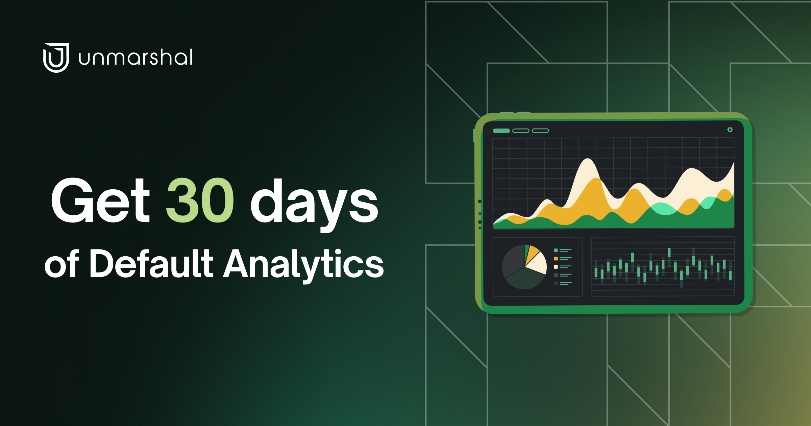
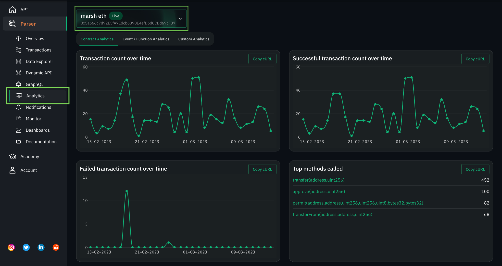
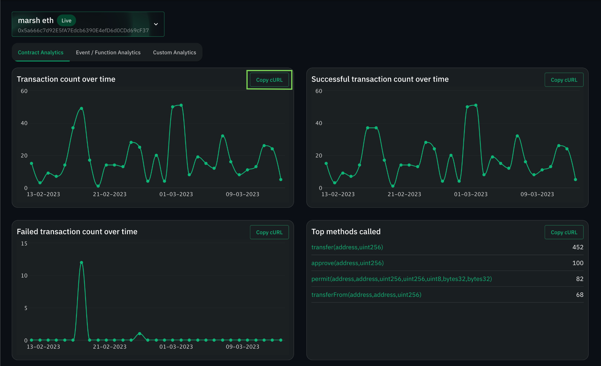
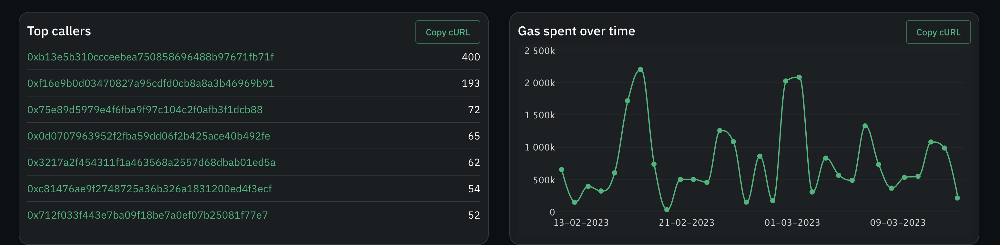
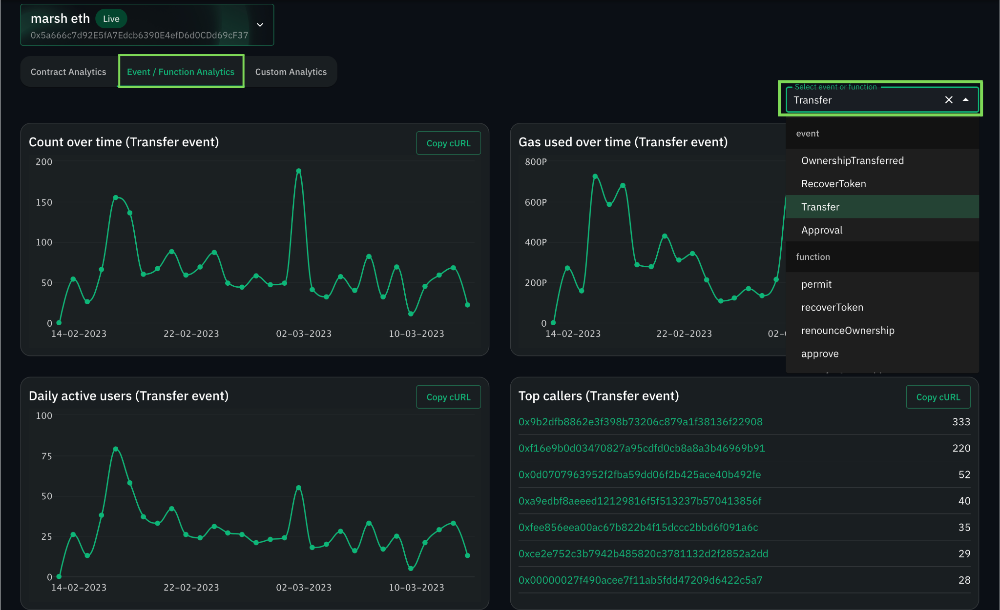

# Accessing parser data through Prebuilt Analytics

Unmarshal's prebuilt analytics provide an efficient and comprehensive solution for developers looking to analyze smart contract data, enabling them to make informed decisions and improve their blockchain applications. This information can help developers identify areas for improvement and optimize their DApps to better serve their users.

Navigate to the Analytics section under the Parser tab and select the parser for which you want to view analytics.

_Note: The data provided in prebuilt analytics is for the last 30 days_

_Fig 1.1 Prebuilt Analytics_

## Contract Analytics

Unmarshal provides 6 key metrics for analyzing data w.r.t. the smart contract which are as follows:

1. Transaction Count over time: Count of transactions associated with the contract.
2. Successful transaction count over time: Count of  successful transactions associated with the contract.
3. Failed transaction count over time: Count of failed transactions associated with the contract.
4. Top methods called: List of most frequently called functions with count.
5. Top callers: List of wallet addresses interacting the most with the contract with count.
6. Gas spent over time: The amount of gas spent over time.

To easily integrate these analytics in your DApp, click on the `Copy cURL` button which will copy to your clipboard, the curl of the request to get the analytics data.

_Fig 1.2 Contract Analytics_

## Event/Function Analytics

Event/Function Analytics allows you to get analytics specific to the Events and Functions added during the creation of the parser. The key metrics provided by default are:

1. Count over time: Number of times the selected event/function was executed.
2. Gas used over time: Amount of gas spent.
3. Daily active users: Count of users active on each day.
4. Top callers: The wallet addresses which have called the event/function maximum number of times.

Navigate to the Event/Function Analytics tab and select the event/function for which you want to view analytics.

_Fig 1.3 Event/Function Analytics_

For more queries, reach out to Unmarshal either on [Telegram](https://t.me/Unmarshal_Chat), [Twitter](https://twitter.com/unmarshal) or [Discord](https://discord.gg/SqhYdGYtEr) and we can help you out with this.
