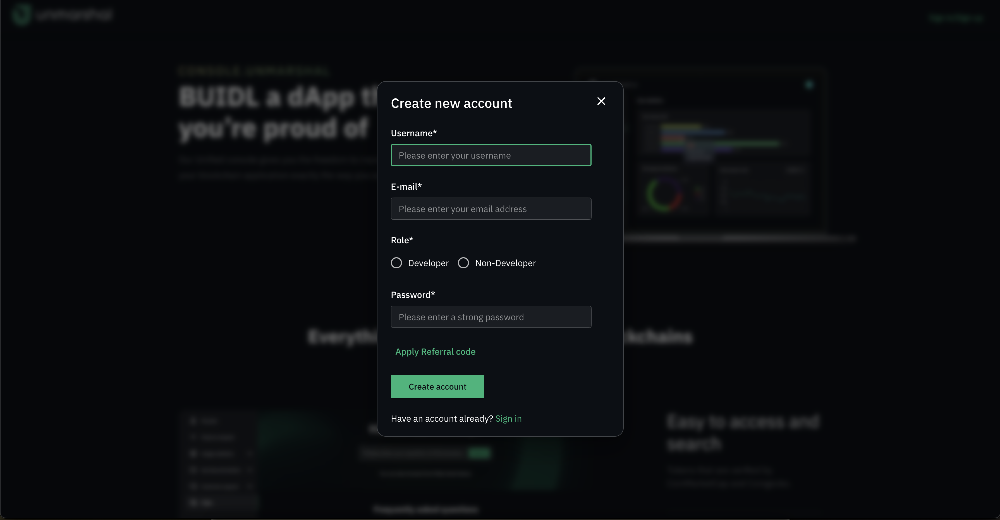
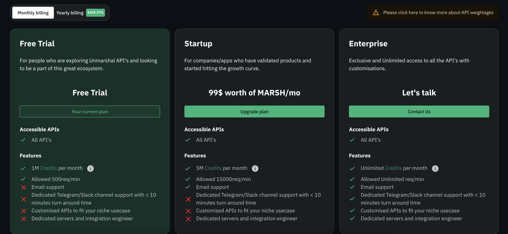

# How do I Sign Up for Unmarshal APIs?

**Step 1:** Visit [console.unmarshal.io](https://console.unmarshal.io) and create your account to start using our free plan.

 

 

---
**Step 2:** Once you login, an API Authentication Key is provided on the top right hand corner under ‘current plan’ section. This auth key allows users to access the staging environment. Simply attach the auth key (auth_key) as a query param of API urls to access a particular endpoint. The API urls are provided in our docs for your reference: [console.unmarshal.io](https://console.unmarshal.io).

 

 

---

**Step 3:** Since this is free to use for projects to test the API endpoints, users will need to contact us at [support@unmarshal.io](mailto:support@unmarshal.io), to upgrade their plan. This process will soon be automated and users can upgrade with a single click as we integrate with a crypto payment gateway.

---

Choose between `Startup`, `Scale`, or `Enterprise`, as per your requirements. The features and accessibility is described in the image below. The paid plans will give you full access to the production environment.

 

Visit [https://unmarshal.io/pricing](https://unmarshal.io/pricing) to view our pricing plans. Below is a quick screenshot:

 

 

**Note:** If you face any issues integrating with Unmarshal APIs, please join our discord server and drop a message in the Developer Hive channel. You can even reach out to us on our Telegram Group. If you require custom APIs, write to us at [support@unmarshal.io](mailto:support@unmarshal.io).

 

 [https://discord.gg/SqhYdGYtEr](https://discord.gg/SqhYdGYtEr)

 [https://t.me/Unmarshal_Chat](https://t.me/Unmarshal_Chat)
